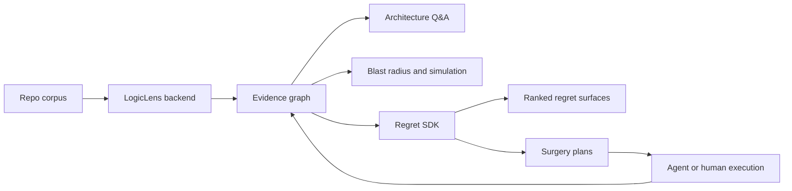

# Alignment And Trajectory - 2026-04-28

**Status note (2026-05-06):** Phase 17 fixture-gated evidence retrieval is **implemented** per `paper-checklist`; see `README.md` and `PROJECT.md` for the frozen corpus and CLI gate.

Purpose: reset the path from the current `heart-transplant` backend toward two connected products:

- a LogicLens-style backend that implements the paper-grade architecture we set out to build,
- a Regret SDK that uses that backend to find, explain, and remediate architectural regret.

## Current Position

We are not at self-serve private-beta product yet, but the backend spine is materially stronger than before the 50-repo pass, and **Phase 17** now provides a **committed, CI-gated** evidence-benchmark on the `test/logiclens` fixture (`docs/evals/fixtures/logiclens-evidence-benchmark/`, `docs/evals/evidence_benchmark_report.json`). **`paper-checklist` marks `evidence_retrieval` as implemented on that corpus only**; real-repo variance is explicitly deferred.

- Tree-sitter ingest plus SCIP-backed identity for local repos.
- File-surface graph nodes and SCIP-only orphan promotion so graph joins target materialized nodes.
- Parser coverage for TypeScript/TSX/JavaScript/Python/Go/Prisma/Rust/Java/C/C++.
- Durable structural artifacts and SurrealDB graph loading.
- A 24-block ontology and deterministic block classifier.
- MCP, canonical graph, evidence-backed CLI graph surfaces, and the first scored evidence-QA benchmark.
- Blast-radius, temporal, causal, regret, execution, and multimodal first passes.
- Gold benchmark files and dated trending-repo corpus input rails.
- A preserved 50-repo EC2 synthesis with the nine first-run complications documented and fix notes landed.

The current shape is demoable and useful for internal proof, but not self-serve beta-ready. The remaining gaps are **real-repo** evidence measurement (Phase 18+), corpus rerun evidence, semantic holdout quality, and operator contract polish — not a lack of direction.

## North Star

The LogicLens backend should be the architectural intelligence substrate. It should ingest a repo, build an evidence-backed multi-layer program graph, answer architecture questions with citations, and expose traversal tools an agent can use without hallucinating structure.

The Regret SDK should be the product rail on top. It should detect accumulating architectural regret, explain why it matters, estimate blast radius and migration risk, and produce reviewable surgery plans that can become agent tasks.

The relationship is simple:

## What The LogicLens Backend Must Become

The backend should move from "artifact generator with useful graph tools" to "paper-grade architecture graph service."

Required capabilities:

- Structural fidelity: every code/file/test/API/infra node that can be targeted by an edge must be materialized and addressable.
- Semantic measurement: block labels, summaries, entities, and actions must be benchmarked against holdout repos, not only generated.
- Retrieval evidence: graph traversal returns scoped **EvidenceBundle** receipts (node IDs, paths, confidence, limitations). **Phase 17** freezes a **fixture-based** `evidence-benchmark` (accuracy ≥ 0.80, hallucination_rate = 0); extending the same harness to diverse real repos without a version bump is **Phase 18** work.
- Temporal replay: historical snapshots must replay ingest over historical source; current replay covers selected Tree-sitter snapshots, while SCIP + semantic replay is still future work.
- Multimodal joins: test, OpenAPI, infra, and code layers must join on real nodes, not synthetic dangling IDs.
- Operator contract: CLI/MCP commands must run on a clean Windows checkout without private harnesses or encoding failures.

## What The Regret SDK Must Become

The SDK should not start as a generic "AI refactor planner." It should start as a narrow architecture-regret engine with receipts.

Required capabilities:

- Regret patterns: logging inconsistency, database sprawl, auth scattering, config leakage, queue/job sprawl, vendor lock-in, missing observability, and temporal drift.
- Evidence bundle: every regret needs affected nodes, graph path evidence, temporal evidence when available, and confidence.
- Surgery planner: every regret type needs a domain-correct remediation plan, not a generic template.
- Simulation: before recommending a change, estimate blast radius and likely collateral edits.
- Execution ledger: plans should produce auditable steps and validation commands, even before autonomous execution is trusted.
- SDK contract: stable JSON schemas and CLI/API methods that downstream agents can call.

## Immediate Trajectory

### Track 1: Beta Trust Rails

Goal: make local beta operation boring and reproducible.

Status: landed in `main`; now needs verification against the artifact we intend to ship.

- `run-hard-gates.ps1` / `run-hard-gates.cmd` no longer call a private absolute harness; they run in-repo `pytest`, `program-surface`, `validate-gates`, and `maximize-gates`.
- Ingest skips `.venv-win`, common virtualenv folders, VCS folders, and cache/build output directories.
- Windows console encoding for `simulate-change` is covered by the Phase 10 test path.
- Project status now treats older hard-gate pass claims as stale until regenerated by the repo-local shortcut.
- README now describes legacy prototype exclusion without pointing to an archive path.
- GitHub Pages now exposes a repo-surgery console with live browser-side GitHub repo intake, block output, 50-repo benchmark graphs, and a complication/fix table.

Exit criteria: run the landed trust rails on the shipping artifact and record the exact artifact/gold/holdout inputs that beta users should reproduce.

### Track 2: Block Benchmark Rails

Goal: prove semantic block quality separately from graph coverage.

- Keep the `block-benchmark` / `phase-metrics` / `evidence-benchmark` paths as the benchmark surfaces and make the reports reproducible from committed commands.
- Report end-to-end accuracy, scorable accuracy, missing-node rate, multi-label recall, and per-block confusion.
- Clean contradictory gold rows in `clean-elysia`.
- Continue using file-surface nodes and secondary block scoring to reduce missing-node and single-label failures.
- Rerun the 50-repo daily-trending corpus after the traversal/parser fixes, then graduate stable examples into gold.

Current preserved baseline from `docs/evals/block-classification-benchmark-2026-04-27.md`: `72.7%` scorable holdout accuracy and `45.0%` missing-node rate. This baseline predates file-surface materialization and secondary block scoring; rerun it before using the numbers as a current launch claim. Exit criteria: at least `80%` scorable holdout accuracy, at most `15%` missing-node rate, and a reproducible report under `docs/evals/`.

### Track 3: Paper-Grade Graph Completion

Goal: remove dangling joins and path-only approximations.

- Keep code-file nodes materialized so Phase 13 cross-layer correlations target real graph nodes.
- Extend temporal replay from selected Tree-sitter snapshots to SCIP + semantic replay where needed.
- Store snapshot lineage in graph form, not only report JSON.
- Add graph integrity gates for dangling edges, stale provisional IDs, and synthetic target leakage.

Exit criteria: multimodal and temporal claims survive graph integrity checks.

### Track 4: Regret SDK Contract

Goal: make regret detection a product, not just a CLI report.

- Define `RegretSurface`, `RegretEvidence`, `SurgeryPlan`, `SimulationResult`, and `ExecutionLedger` schemas.
- Fix regret-specific planner branches, starting with logging inconsistency.
- Add fixtures for known regrets with hidden labels.
- Gate every regret type on evidence relevance and plan specificity.
- Add a small SDK wrapper around the CLI so agents can run scans and consume JSON without shell parsing.

Exit criteria: an agent can call the SDK on a repo and receive ranked, typed, evidence-backed regrets with credible next actions.

## Private Beta Shape

The private beta should not promise "automatic architecture repair." It should promise:

- ingest your repo into a graph,
- label architectural blocks,
- answer graph-backed architecture questions,
- show likely blast radius,
- surface early regret candidates,
- export JSON evidence an agent can use.

The beta user gets architectural visibility and triage, not full autonomous migration. That is still valuable, and it is much safer to sell.

## Next Execution Queue

1. Rerun the full 50-repo corpus after the traversal/parser fixes and publish the strict corpus-gate result.
2. Rerun the holdout block benchmark after file-surface and multi-label scoring changes.
3. Clean contradictory holdout gold rows and graduate stable 50-repo examples into gold.
4. Expand the scored evidence-QA benchmark for `answer-with-evidence` and graph traversal commands.
5. Fix logging-regret surgery planning and add regret fixtures with hidden labels.
6. Run beta trust rails on the shipping artifact and publish the exact reproduction inputs.
7. Draft the first Regret SDK JSON schema document and test fixtures.

## Decision

The trajectory from here is not "more phases." It is tightening the rails around what already exists:

- LogicLens backend equals evidence-backed graph plus measured semantic retrieval.
- Regret SDK equals productized regret detection on top of that graph.
- The beta launch becomes credible when the benchmark, gates, and operator path all agree.

The execution tranche that turns this alignment into measurable exits is
`docs/roadmaps/logiclens-next-tranche-2026-04-27.md`.
